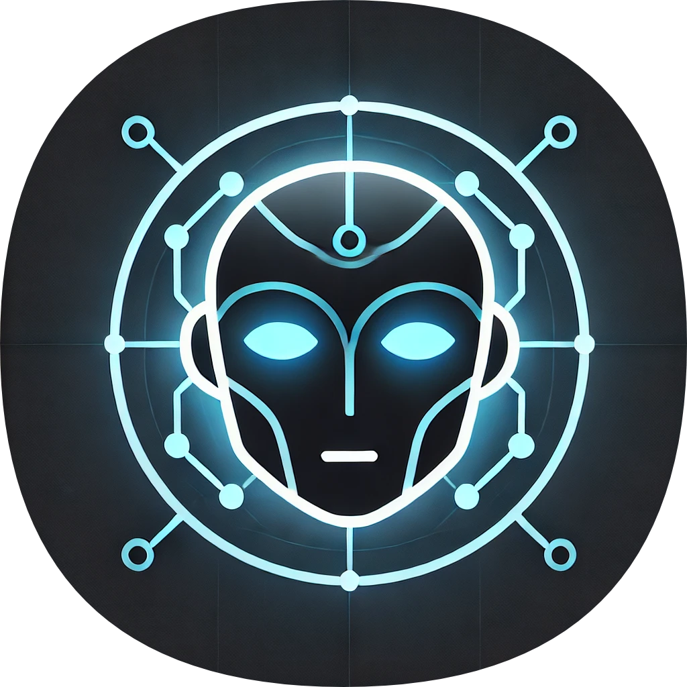

# J.A.R.V.I.S

<div align="center">
  
</div>

<div align="center">
  <a href="https://github.com/CogitoNTNU/README-template/blob/main/LICENSE" alt="LICENSE">
          </a>
  <a href="" alt="platform">
          </a>
  <a href="" alt="version">
          </a>
</div>
<details> 
<summary><b>📋 Table of contents </b></summary>

- [J.A.R.V.I.S](#jarvis)
  - [About](#about)
  - [Reminder - Not suited for production](#reminder---not-suited-for-production)
  - [Prerequisites](#prerequisites)
  - [Usage](#usage)
  - [Testing](#testing)
  - [Documentation](#documentation)
  - [Team](#team)
  - [License](#license)

</details>


## About 
Open-source agentic system developed by Cogito-NTNU to autonomously do LLM-powered tasks in the background.

Just A Rather Very Intelligent System (J.A.R.V.I.S). We’re building an AI assistant inspired by Iron Man's Jarvis, capable of managing and solving complex tasks autonomously. Users should be able to converse with Jarvis naturally. Similar to Jarvis in the movies, or the ChatGPT4o demo. 

J.A.R.V.I.S is a voice-controlled AI assistant that can help you with various tasks. It is designed to be a personal assistant that can help you with everyday tasks, such as setting reminders, answering questions, and providing information. The goal of J.A.R.V.I.S is to make your life easier by providing you with the information you need when you need it.


**Main functionality will be:**
- Natural conversation (TTS, Speech, Norsk?)
- Simple function execution
- Long term memory using RAG & Vector DBs
- Reliability (Validate input & output)
- Asynchronous Sub-processes (Do stuff while talking to the user, like browsing the web)

## Reminder - Not suited for production
Traffic on this application is NOT encrypted.
Only host it yourself and do NOT deploy to a public server where others can access the site.

## Prerequisites
Before you start, make sure the following tools are installed on your system to run the project:
- **Git:** Version control system to clone the project repository [Download Git](https://git-scm.com/downloads)
- **Docker:** To containerize the application and ensure it runs consistently across different environments [Download Docker](https://www.docker.com/products/docker-desktop)

## Usage
To run the project, run the following command from the root directory of the project:
```bash
docker compose up --build
```
if (on windows) it has issues with port permissions do

```bash
net stop winnat
docker compose up --build
net start winnat
```

The "--build" flag on the docker command is to rebuild the images with any code changes. It's strictly not necessary if you're not modifying code.

## Testing
To run the test suite, run the following command from the root directory of the project:
```bash

```

## Documentation
- [Developer Setup](docs/manuals/developer_setup.md)

## Team
This project would not have been possible without the hard work and dedication of all of the contributors. Thank you for the time and effort you have put into making this project a reality.

<table align="center">
    <tr>
        <td align="center">
            <a href="https://github.com/EldarAlvik">
              <br />
              <sub><b>EldarAlvik</b></sub>
            </a>
        </td>
        <td align="center">
            <a href="https://github.com/igiwa001">
              <br />
              <sub><b>igiwa001</b></sub>
            </a>
        </td>
        <td align="center">
            <a href="https://github.com/JonBergland">
              <br />
              <sub><b>Jon Bergland</b></sub>
            </a>
        </td>
        <td align="center">
            <a href="https://github.com/klungg">
              <br />
              <sub><b>klungg</b></sub>
            </a>
        </td>
        <td align="center">
            <a href="https://github.com/martin0x48">
              <br />
              <sub><b>martin0x48</b></sub>
            </a>
        </td>
        <td align="center">
            <a href="https://github.com/TheStrgamer">
              <br />
              <sub><b>Konrad Seime</b></sub>
            </a>
        </td>
        <td align="center">
            <a href="https://github.com/WilliamMRS">
              <br />
              <sub><b>William M Schmidt</b></sub>
            </a>
        </td>
    </tr>
    <tr>
        <td align="center">
            <a href="https://github.com/IvanMordovets">
              <br />
              <sub><b>Ivan Mordovets</b></sub>
            </a>
        </td>
       <td align="center">
            <a href="https://github.com/Nilsthehacker">
              <br />
              <sub><b>Nils Henrik Hoelfeldt Lund</b></sub>
            </a>
        </td>
        <td align="center">
              <a href="https://github.com/erlendska">
                <br />
                <sub><b>Erlend Skaarberg</b></sub>
              </a>
          </td>
        <td align="center">
              <a href="https://github.com/DuckLeQuack">
                <br />
                <sub><b>Muhammad H. Muwaffaq</b></sub>
              </a>
          </td>
    </tr>
</table>


<!--  -->

## License
This project is licensed under the MIT License - see the [LICENSE](LICENSE) file for details.
