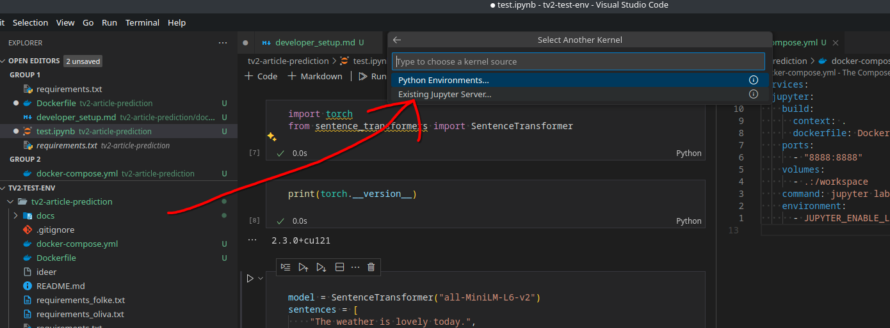
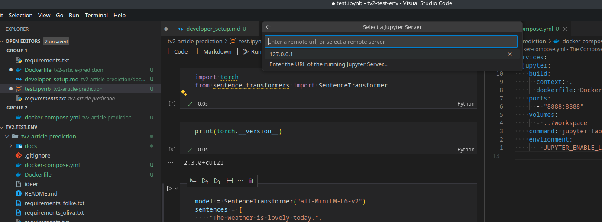

# Developer Setup
This document provides instructions on how to set up the project on your local machine for development purposes.

*By doing the following steps, you will be able to code, test, and run the project on your local machine using a Jupyter Notebook server running in a Docker container to ensure a consistent environment across different machines.*


## Prerequisites
Before you start, make sure the following tools are installed on your system:
- **Git:** Version control system to clone the project repository [Download Git](https://git-scm.com/downloads)
- **Docker:** To containerize the application and ensure it runs consistently across different environments [Download Docker](https://www.docker.com/products/docker-desktop)
- **Python:** Programming language used to build the application [Download Python](https://www.python.org/downloads/)


## Usage
To run the project, you can use the following commands:
```bash
docker compose up --build
```

This command will build the Docker image and start the jupyter notebook server. You can access the notebook by visiting `http://localhost:8888` in your browser.


### Using the Jupyter Notebook Server
When you run the command above, you will see a URL with a token that you can use to access the jupyter notebook server. You can copy and paste this URL into your browser to access the notebook.

First open a jupyter notebook and press `Select Kernel` 



Then enter the server url and token to run the notebook on the server but be able to code on your local machine.



Then select the default option to run the notebook on the server.

### Running terminal commands on the server
You can run the following command to open a terminal on the server:
```bash
docker exec -it jarvis-jupyter bash
```

### Stopping the Server
When you are done working on the project, you can stop the server by pressing `Ctrl + C` in the terminal and running the following command:
```bash
docker compose down
```